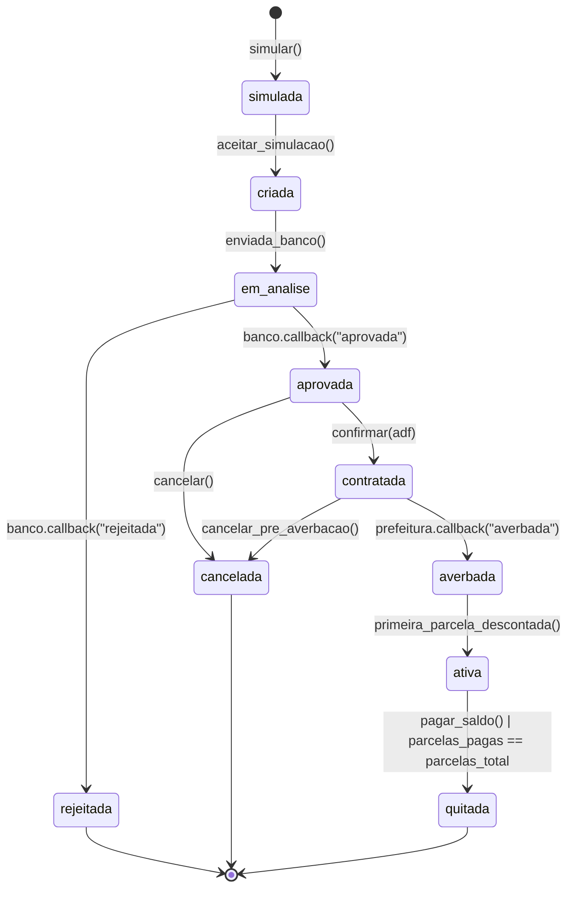
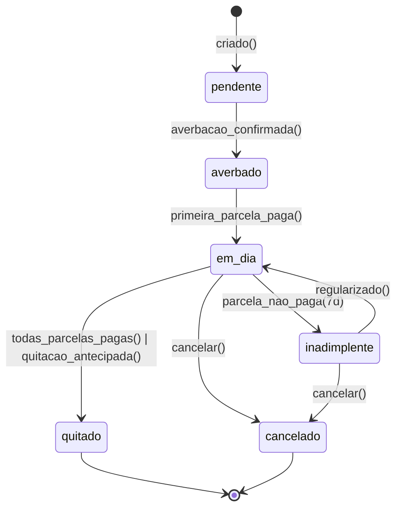
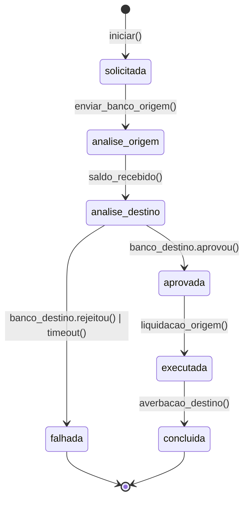
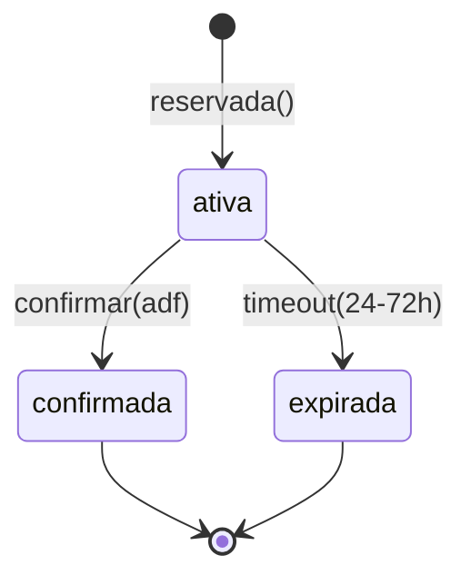

# Atlas — Maquinas de Estado

Fonte unica para transicoes de entidades. Codigo deve implementar via `packages/domain` e expor via MCP `atlas-domain` (`domain://state-machine/{entity}`).

## Proposta



Eventos que disparam transicoes:
| Evento | De | Para |
|---|---|---|
| `simular` | * | `simulada` |
| `aceitar_simulacao` | `simulada` | `criada` |
| `enviar_banco` | `criada` | `em_analise` |
| `banco_aprova` | `em_analise` | `aprovada` |
| `banco_rejeita` | `em_analise` | `rejeitada` |
| `confirmar` | `aprovada` | `contratada` |
| `prefeitura_averba` | `contratada` | `averbada` |
| `primeira_parcela` | `averbada` | `ativa` |
| `quitar` | `ativa` | `quitada` |
| `cancelar` | `aprovada`, `contratada` (pre-averbacao) | `cancelada` |

## Contrato



## Portabilidade



Regulamentacao: BACEN Resolucao 4.292/2013. Banco origem tem **5 dias uteis** para enviar saldo devedor; banco destino tem **5 dias uteis** para decisao apos receber saldo.

## Reserva de emprestimo (banco)



## Validacao de transicao

A funcao canonica:

```ts
domain_next_state(entity: 'proposta'|'contrato'|'portabilidade'|'reserva', current: string, event: string): string | { error: 'invalid_transition' }
```

Implementacao em `packages/domain/src/state-machines/` e exposta pelo MCP `atlas-domain` tool `domain_next_state`.

## Auditoria

Toda transicao gera linha append-only em `<entity>_eventos`:
```
id, <entity>_id, evento, de_estado, para_estado, ator (user_id|system|banco|prefeitura), payload_hash, trace_id, criado_em
```
Nunca atualizamos ou removemos eventos.
